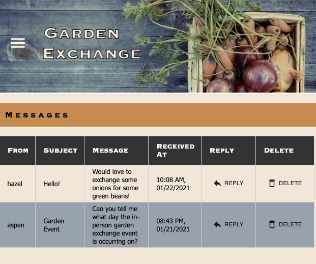

# Garden Exchange

## Description

Duration: Two week sprint

Garden exchange is a responsive, full-stack web application that creates a platform for users to trade surplus home goods and
produce from their gardens. Traders can view and search for listings in their area, edit their listings, 
and message other participants if they are interested in trading.

See the deployed app on [Heroku]()

## Screen Shot



### Prerequisites

- [Node.js](https://nodejs.org/en/)
- PostgreSQL
- React-redux

## Installation

1. Create a database named `garden_exchange`,
2. The queries in the `database.sql` file are set up to create all the necessary tables and populate the needed data to allow the application to run correctly. The project is built on [Postgres](https://www.postgresql.org/download/), so you will need to make sure to have that installed. We recommend using Postico to run those queries as that was used to create the queries. 
3. Open up your editor of choice and run an `npm install`
4. Run `npm run server` in your terminal
5. Run `npm run client` in your terminal
6. The `npm run client` command will open up a new browser tab for you!
7. - Create a `.env` file at the root of the project and paste this line into the file:
  ```
  SERVER_SESSION_SECRET=superDuperSecret
  ```
  While you're in your new `.env` file, take the time to replace `superDuperSecret` with some long random string like `25POUbVtx6RKVNWszd9ERB9Bb6` to keep your application secure. Here's a site that can help you: [https://passwordsgenerator.net/](https://passwordsgenerator.net/). If you don't do this step, create a secret with less than eight characters, or leave it as `superDuperSecret`, you will get a warning.
8. Also in the `.env` file you will need to paste in password = -place your password here- and insert your password for your email 
of choice. In message.router.js your will need to modify the lines below to reflect your email:       
        auth: {
            user: 'jfredericksen12@gmail.com',
            pass: password
            },
9. Adminstrators: after your database tables are created and at least one user has been created, manually change the administrator 
  boolean from false to true and that user will have access to the admin page. 

## Usage

1. Forum Page: Users can scroll through the different listings or utilize the search bar to specify a critiria. Once they 
  find a match they can click the message button to have a pop-up form come up to send a message to a different user.
2. Add Listing: Users can fill out the add listing form and have their new post generated on the forum page
3. Messages: All of the users messages are displayed on this page. Users can reply to and delete messages as needed.
4. Profile: Users can manage all of their forum listings and gallery posts on this page. They can edit or delete their 
  posts as needed. Users can also subscribe/unsubscribe from email notifications on this page. 
5. Gallery: Users can upload a picture and its description to the gallery for others to view and enjoy. A place to share
  recipes, photos from the exchange, and words of wisdom.
6. Support Form: If users need assistance with the sight or want to supply feedback they can submit the support form which 
  goes directly to the adminstrator. 
7. Admin Page: Administrators of the site have access to all of the listings, gallery posts, and support messages and can 
  reply and delete as needed. 

## Built With

- React
- Redux
- JavaScript
- PostgreSQL
- HTML/CSS
- Material UI
- Nodemailer
- Filestack API
- Express
- Moment
- Node.js
- SweetAlerts
- Passport


## License


## Acknowledgement
Thanks to [Prime Digital Academy](www.primeacademy.io) who equipped and helped me to make this application a reality.

## Support
If you have suggestions or issues, please email me at [jfredericksen12@gmail.com](www.google.com)